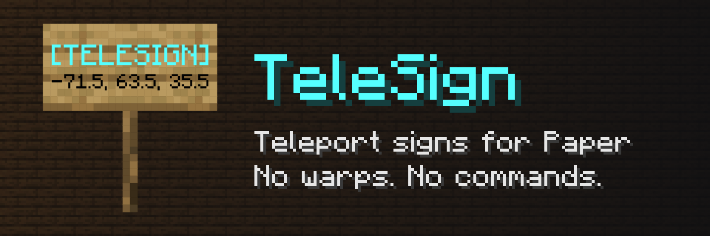

<div align="center">



Write coordinates on a sign, and anyone who clicks it is teleported there. No warps to set up, no commands to learn.

[](https://modrinth.com/plugin/telesign)
[](https://hangar.papermc.io/andret2344/TeleSign)
[](https://github.com/andret2344/TeleSign/releases/latest)

[](https://github.com/andret2344/TeleSign/actions/workflows/build.yml)
[](https://codecov.io/gh/andret2344/TeleSign)
[](https://papermc.io/software/paper)
[](https://adoptium.net/)
[](LICENSE)

[Download on Modrinth](https://modrinth.com/plugin/telesign) ·
[Download on Hangar](https://hangar.papermc.io/andret2344/TeleSign) ·
[Report a bug](https://github.com/andret2344/TeleSign/issues)

</div>

## Features

- **Just a sign** - the destination is written on the sign itself: a world and coordinates, optionally with the
  direction to face.
- **Two ways from one sign** - the front and the back can each lead somewhere else; the side the player faces counts.
- **Snapshot of a player** - write `@Steve` and the sign leads to where Steve stands right now, rounded to half a block.
- **Survives restarts** - destinations are stored in the sign's block data, not in a file.
- **Looks the way you want** - the text of created signs comes from `config.yml` in the
  [MiniMessage](https://docs.papermc.io/adventure/minimessage/format/) format, refreshed on `/telesign reload`.
- **Safe** - only operators can create and break teleport signs by default, region protection plugins are respected,
  and a sign leading to a deleted world says so instead of failing.

## Installation

1. Download the jar from [Modrinth](https://modrinth.com/plugin/telesign),
   [Hangar](https://hangar.papermc.io/andret2344/TeleSign) or
   [GitHub](https://github.com/andret2344/TeleSign/releases/latest).
2. Put it into the `plugins` folder of a Paper (or Purpur) 26.2+ server running Java 25.
3. Start the server. Optionally edit `plugins/TeleSign/config.yml` and run `/telesign reload`.

## Creating a teleport sign

Write the lines while placing a sign, on its front, its back or both. The first line is always `[TELESIGN]` (any case).
Each side gets its own destination, and clicking the sign teleports to the destination of the side the player faces.

### Coordinates

```
[TELESIGN]
[world]
[x, y, z]
[yaw, pitch]
```

The yaw and pitch on the last line are optional and default to `0`. They can also be written on the third line,
`[x, y, z, yaw, pitch]`. All values accept decimals and negative numbers. The world has to exist.

### Where a player stands

```
[TELESIGN]
@Steve
```

The player has to be online when the sign is written. The sign keeps the place where they stood then, with x, y and z
rounded to the nearest `0.5`; it does not follow the player later.

## Commands and permissions

| Command            | Permission        | Description                                                     |
|--------------------|-------------------|-----------------------------------------------------------------|
| `/telesign reload` | `telesign.reload` | Loads the config again and refreshes the signs in loaded chunks |

`/tsigns` is an alias of `/telesign`.

| Permission        | Default  | Description                                                        |
|-------------------|----------|--------------------------------------------------------------------|
| `telesign.use`    | everyone | Teleports by right-clicking a teleport sign                        |
| `telesign.create` | operator | Turns a sign into a teleport sign                                  |
| `telesign.break`  | operator | Breaks a teleport sign; without it breaking one is cancelled       |
| `telesign.reload` | operator | Runs `/telesign reload`                                            |
| `telesign.*`      | -        | All of the above                                                   |

## Configuration

`config.yml` sets how a sign looks once it becomes a teleport sign:

```yaml
# Exactly four lines in the MiniMessage format
# Placeholders: <world>, <x>, <y>, <z>, <yaw>, <pitch>
lines:
  - '<aqua>[TELESIGN]'
  - ''
  - '<world>'
  - '<x>, <y>, <z>'
```

Signs are refreshed with the current lines when the plugin starts, on `/telesign reload` and when their chunk loads.
`/telesign reload` keeps the current lines when the new config is invalid and says what is wrong with it.

### Things to keep in mind

- The destinations are stored in the data that Paper adds to each sign. Opening the world in singleplayer or on a
  vanilla server removes that data, and the teleport signs turn into regular signs.

## Building from source

```sh
./gradlew build
```

The plugin jar is `build/libs/TeleSign-<version>.jar`. The build runs the test suite (JUnit and MockBukkit);
[Codecov](https://codecov.io/gh/andret2344/TeleSign) requires 100% coverage.

## Metrics

TeleSign sends anonymous usage statistics to [bStats](https://bstats.org/plugin/bukkit/TeleSign/34536). They
can be turned off for all plugins in `plugins/bStats/config.yml`.

## License

Licensed under the [Apache License 2.0](LICENSE). If you redistribute this plugin or anything built from it, you have
to keep the contents of the [NOTICE](NOTICE) file, which links back to this repository.
